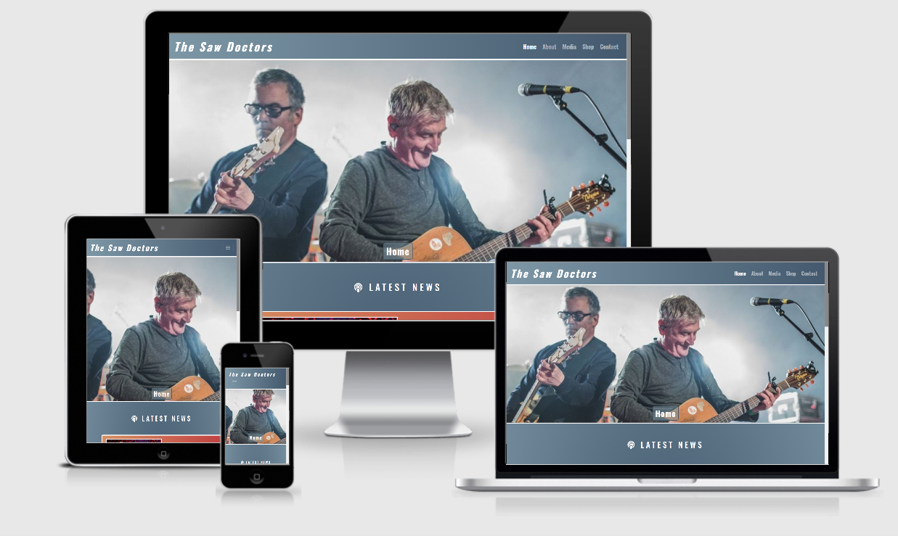
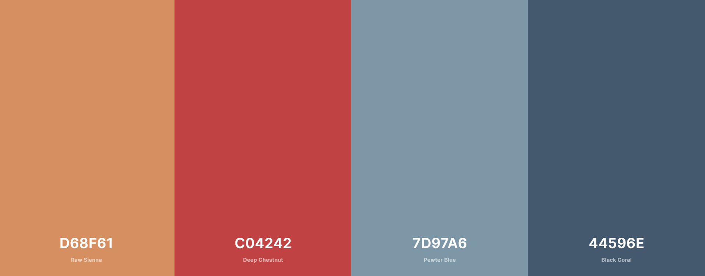

# The Saw Doctors

Website created for fans of “The Saw Doctors”, an Irish band from County Galway, who hold the record for Ireland’s all-time biggest-selling single “I Useta lover”.

Link to the deployed website is [here](https://jamessinnott1994.github.io/saw-doctors/).

## Table of Contents
- [User Experience (UX)](#user-experience-(ux))
    - [User Stories](#user-stories)
    - [Strategy](#strategy)
    - [Scope](#scope)
    - [Structure](#structure)
    - [Skeleton](#skeleton)
    - [Surface](#surface)
- [Technologies](#technologies)
- [Testing](#testing)
- [Deployment](#deployment)
- [Credits](#credits)

---
## User Experience (UX)

### User Stories
As a **fan**, I want:
1.	The ability to navigate through the site in a smooth and intuitive fashion.
2.	To see the band's latest news and activities.
3.	The ability to book the band for gigs.
4.	The ability to contact the band for general queries.
5.	To have the option of purchasing the band's music/merchandise.
6.	To follow the band on their social media accounts.

As a **potential fan**, I want:
1.	The ability to navigate through the site in a smooth and intuitive fashion.
2.	The ability to watch and listen to some of the band's music videos and clips.
3.	The ability to find out more about those involved in the band and their history.

As a **site owner**, I want:
1.	To showcase the band's latest news and activities.
2.	To provide contact information for booking and other queries.
3.	To sell more of the band's music/merchandise.
4.	To provide details about the band's history and members.
5.	To showcase some of the band's best known songs with videos and music clips.
6.	To provide links to the band's social media accounts.

### Strategy
- Project goals:
    - The goal of "The Saw Doctors" website is to provide a clean, intuitive site that will allow visitors to find out more about the band, listen to some of their music, purchase the band's music/merchandise, and allow visitors to contact or book the band.
    - The Saw Doctors website has two target audiences: fans and potential fans of the band.
- Focus:
    - The main focus of the project is to create a website for the band so as to increase their online presence. This site will be the go-to place for fans and potential fans of the band to find out all they need to know about the band and their latest activities.
- Definition:
    - We are creating a custom built unique website for the band that will be intuitive and responsive on different devices.
- Value:
    - The value for the band in having this site is that it will help drive traffic towards the band’s social media accounts, will increase sales through purchasing of the band’s music/merchandise, and will get more work for the band through online bookings.
    - The value for fans and potential fans is that the site will help them to achieve their goals of finding out the latest news involving the band, learning more about the band’s history, and purchasing the band’s music/merchandise.

### Scope
- Features:
    - Fixed navigation area which has links for the user to all pages of the website.
    - Information area that gives the latest news and touring dates for the band.
    - Give a brief history of the band and who the members are.
    - Provide details for contacting the band for general queries and for bookings.
    - Shop area where songs & merchandise can be purchased.
    - Media area where the user can click to play music videos and songs.
    - Footer area that links to the band’s social media accounts.
    - Built using best practices of semantic HTML and accessibility.
    - Be fully responsive for mobile use.

### Structure
The website will be broken down into five areas in order to achieve the project goals and meet the user stories:
1.	Home Page:
- The Home Page will be catered towards fans of the band. The priority here is to show the band’s latest activities and tour dates.
- At the bottom of the main section of the body, a picture will act as a link to the About page of the website. This is to encourage potential fans visiting the page for the first time to find out more about the band.
2.	About Page:
- The About Page will give a history of the band and all of the successes they have had in their career.
- The page will also show pictures of the band’s members at the bottom of the page.
3.	Media Page:
- The Media Page will showcase some of the band’s most successful songs. This is to encourage potential fans to listen to more of the band’s music.
4.	Shop Page:
- The Shop Page will allow fans to purchase the band’s music/merchandise.
- At least eight album pictures will be shown on this page, with four being arranged on each line. Underneath the album picture, the name of the album and it’s price will be displayed. A button will also be here that will allow the user to buy the album.
5.	Contact Page:
- The Contact Page will contain a simple form which will allow fans and potential fans to contact the band for booking and general queries.
- It will also show the contact details.

### Skeleton
1. Home Page Wireframe:
    - [Mobile](https://github.com/JamesSinnott1994/saw-doctors/blob/master/wireframes/home/home-mobile.png)
    - [Tablet](https://github.com/JamesSinnott1994/saw-doctors/blob/master/wireframes/home/home-tablet.png)
    - [Desktop](https://github.com/JamesSinnott1994/saw-doctors/blob/master/wireframes/home/home-desktop.png)
2. About Page Wireframe:
    - [Mobile](https://github.com/JamesSinnott1994/saw-doctors/blob/master/wireframes/about/about-mobile.png)
    - [Tablet](https://github.com/JamesSinnott1994/saw-doctors/blob/master/wireframes/about/about-tablet.png)
    - [Desktop](https://github.com/JamesSinnott1994/saw-doctors/blob/master/wireframes/about/about-desktop.png)
3. Videos Page Wireframe:
    - [Mobile](https://github.com/JamesSinnott1994/saw-doctors/blob/master/wireframes/videos/videos-mobile.png)
    - [Tablet](https://github.com/JamesSinnott1994/saw-doctors/blob/master/wireframes/videos/videos-tablet.png)
    - [Desktop](https://github.com/JamesSinnott1994/saw-doctors/blob/master/wireframes/videos/videos-desktop.png)
4. Shop Page Wireframe:
    - [Mobile](https://github.com/JamesSinnott1994/saw-doctors/blob/master/wireframes/shop/shop-mobile.png)
    - [Tablet](https://github.com/JamesSinnott1994/saw-doctors/blob/master/wireframes/shop/shop-tablet.png)
    - [Desktop](https://github.com/JamesSinnott1994/saw-doctors/blob/master/wireframes/shop/shop-desktop.png)
5. Contact Page Wireframe:
    - [Mobile](https://github.com/JamesSinnott1994/saw-doctors/blob/master/wireframes/contact/contact-mobile.png)
    - [Tablet](https://github.com/JamesSinnott1994/saw-doctors/blob/master/wireframes/contact/contact-tablet.png)
    - [Desktop](https://github.com/JamesSinnott1994/saw-doctors/blob/master/wireframes/contact/contact-desktop.png)

### Surface
- Typography:
    - Oswald will be the font that is used for header and titles.
    - Roboto will be the font used for the paragraph text.
- Colour scheme:
    
    - I decided to use two primary colour gradients.
    - For the navbar and background, there was a gradual blending from Pewter Blue to Black Coral.
    - For the foreground elements and footer, there was a gradual blending from Raw Sienne to Deep Chestnut.
- Media:
    - I will use images of The Saw Doctors band.
    - I will use a music video of the band.
    - I will use Spotify music clips from the band.
- Effects:
    - There will be a hover effect over the links in the navigation bar.
    - There will be a hover effect over some of the images, particulary on the Shop page.
    - There will be a hover effect over the buttons.
    - There will be a hover effect over the social media icons in the footer of the page.

---
## Technologies

### Workspace

- Gitpod

### Languages

- HTML5
- CSS3

### Frameworks & Libraries

- Bootstrap4
- Font Awesome
- Google Fonts

### Version Control

- Git
- Github

### Wireframes

- Balsamiq

---
## Testing
Separate file for testing is located [here.](TESTING.md)

---
## Deployment
### Deploying to Github pages
The site is deployed on GitHub pages. The setup involved was:

- Using Git, I pushed all my committed code to my repository at [https://github.com/JamesSinnott1994/saw-doctors](https://github.com/JamesSinnott1994/saw-doctors).
- Opened the "Settings" tab in my project repository.
- Scrolled down to 'Github Pages' section.
- Selected 'main' branch and 'root' folder to deploy to GitHub pages, and pressed 'Save'.
- Navigated to https://jamessinnott1994.github.io/saw-doctors/ to view deployed website.

### Creating a local clone
- Project can be downloaded as a .zip file by clicking the 'Code' button in the project repository and clicking 'Download ZIP'.
- Project can also be cloned by entering `git clone https://github.com/JamesSinnott1994/saw-doctors.git` in the terminal.

---
## Credits

### Code Attribution
- Used code relating to the [Bootstrap Navbar](https://getbootstrap.com/docs/4.5/components/navbar/).
- Used code relating to the [Bootstrap Card component](https://getbootstrap.com/docs/4.5/components/card/).
- Used [this code from W3Schools](https://www.w3schools.com/howto/tryit.asp?filename=tryhow_css_image_overlay_opacity) for making a button appear when you hover over it's container.
- Got help from [this StackOverflow post](https://stackoverflow.com/questions/22947703/bootstrap-3-text-align-change-at-breakpoint) for setting text alignment at different breakpoints.
- Got help with doing the Footer code from the Code Institute's [Resume Project](https://learn.codeinstitute.net/courses/course-v1:codeinstitute+FE+2017_T3/courseware/616289d66b5641a3808cc43e53842695/b51f7b8b815c4bcd9979d2281b6d97a9/) in the User Centric Frontend Development module.
- Used [this code from MDN Web Docs](https://developer.mozilla.org/en-US/docs/Web/CSS/linear-gradient()) for doing the gradual colour blending with the background and foreground colours.
- Used [this code](https://www.w3schools.com/cssref/css3_pr_align-items.asp) and also [this code](https://www.w3schools.com/cssref/css3_pr_justify-content.asp) from W3Schools for centering the h1 element at the bottom of the hero image.
- Used [this code](https://www.w3schools.com/howto/howto_css_custom_scrollbar.asp) from W3Schools for creating a custom scrollbar.
- Used [this code](https://getbootstrap.com/docs/4.0/utilities/embed/) from Bootstrap for creating a video embed.
- Used code relating to the [Bootstrap Form](https://getbootstrap.com/docs/4.5/components/forms/).

### Image Source Attribution
- [Hero image](https://www.facebook.com/notes/10155149986579611/)
- [Latest News](https://scontent.fdub5-1.fna.fbcdn.net/v/t31.0-8/12711149_10153496293349611_4157838600472024111_o.jpg?_nc_cat=106&ccb=2&_nc_sid=2d5d41&_nc_ohc=StOMKz-9brkAX8BMeBI&_nc_oc=AQkKfMAfD3Mkm83LigecZCXUqzuerKqxtLfhSuCgJavOTgBJtwODJahMcE3WGIueRWuPjiuHy2sgSHg0ijVU6cy9&_nc_ht=scontent.fdub5-1.fna&oh=cf52c9334f163d64e3402be24e5ef87b&oe=6001A46F)
- [Who We Are image](https://scontent.fdub5-1.fna.fbcdn.net/v/t1.0-9/85096778_1382518601927742_7823035659806834688_o.jpg?_nc_cat=106&ccb=2&_nc_sid=dd9801&_nc_ohc=kR8tAbI3bRQAX9sBaDc&_nc_ht=scontent.fdub5-1.fna&oh=b015b5706e1e83ce2bdd11b0f55748c3&oe=600171E1)
- [N17 image](https://www.irishtimes.com/polopoly_fs/1.4314214!/image/image.jpg_gen/derivatives/landscape_620/image.jpg)
- ["I Useta Lover"](https://images-na.ssl-images-amazon.com/images/I/71rI4MXnmSL._SX522_.jpg)
- ["Sing A Powerful Song"](https://img.discogs.com/mUckRLC0IFWz2rlDgYS2iRnZzdQ=/fit-in/300x300/filters:strip_icc():format(jpeg):mode_rgb():quality(90)/discogs-images/R-6235834-1425663163-9451.jpeg.jpg)
- ["The Cure"](https://cdn.webshopapp.com/shops/134936/files/63754486/the-saw-doctors-cure.jpg)
- [Current Band](https://scontent.fdub5-1.fna.fbcdn.net/v/t31.0-8/p720x720/14500490_10154091898674611_5642841185723893523_o.jpg?_nc_cat=108&ccb=2&_nc_sid=2d5d41&_nc_ohc=pUMNgvZ1r-sAX9VvqyS&_nc_ht=scontent.fdub5-1.fna&tp=6&oh=b202585bda878b8d609558bfe1ed41e0&oe=6002B243)
- [Davy Carton image](https://www4.pictures.zimbio.com/gi/Davy+Carton+Saw+Doctors+Concert+w-n-Ge4nZRkl.jpg)
- [Leo Moran image](https://www3.pictures.zimbio.com/gi/Leo+Moran+Saw+Doctors+Concert+fUNIFsHNvVHl.jpg)
- [Anthony Thistlewaite](https://alchetron.com/cdn/anthony-thistlethwaite-dfe7a0d0-ca60-4cb4-ba4a-81ef14eeaa8-resize-750.jpeg)
- [Kieran Duddy image](https://scontent.fdub5-1.fna.fbcdn.net/v/t31.0-8/p720x720/14500490_10154091898674611_5642841185723893523_o.jpg?_nc_cat=108&ccb=2&_nc_sid=2d5d41&_nc_ohc=pUMNgvZ1r-sAX9VvqyS&_nc_ht=scontent.fdub5-1.fna&tp=6&oh=b202585bda878b8d609558bfe1ed41e0&oe=6002B243)
- [Will Merrigan image](https://scontent.fdub5-1.fna.fbcdn.net/v/t1.0-9/18268309_715176561995286_4160645154993523353_n.jpg?_nc_cat=102&ccb=2&_nc_sid=110474&_nc_ohc=ixh5BhJa1RYAX_m08IW&_nc_ht=scontent.fdub5-1.fna&oh=e21acd317117719f43f3f48f9770d327&oe=600421DF)
- [Rickie O'Neill image](https://declanroche.files.wordpress.com/2012/06/sawdoctors-6.jpg)
- ["If This Is Rock and Roll, I Want My Old Job Back"](https://img.discogs.com/eB9AZRCxrcvJsP-FBY1eYXyIpTA=/fit-in/300x300/filters:strip_icc():format(jpeg):mode_rgb():quality(40)/discogs-images/R-5129550-1503234992-7323.jpeg.jpg)
- ["All the Way from Tuam"](https://img.discogs.com/h74WHZ0BnnAqKdnJ0PgYJ2qxIm0=/fit-in/400x396/filters:strip_icc():format(jpeg):mode_rgb():quality(90)/discogs-images/R-5380664-1425715594-8145.jpeg.jpg)
- ["Same Oul' Town"](https://upload.wikimedia.org/wikipedia/en/e/e2/Same_Oul%27_Town_%28Saw_Doctors_album_cover%29.jpg)
- ["Songs From Sun Street"](https://img.discogs.com/IB4gYONS1pTD9XiEDkMoxZpF3IY=/fit-in/300x300/filters:strip_icc():format(jpeg):mode_rgb():quality(40)/discogs-images/R-4609218-1369837107-5377.jpeg.jpg)
- ["Villains?"](https://img.discogs.com/jFR51ujAFqVyaIr2C6Oqw4alOnE=/fit-in/600x594/filters:strip_icc():format(jpeg):mode_rgb():quality(90)/discogs-images/R-4598498-1384724540-1937.jpeg.jpg)
- ["The Further Adventures of... The Saw Doctors"](https://upload.wikimedia.org/wikipedia/en/e/e7/The_Further_Adventures_of..._The_Saw_Doctors.jpg)
- [Saw Doctors T-Shirt](https://i.etsystatic.com/21646721/r/il/3e601c/2091734274/il_794xN.2091734274_5vbn.jpg)
- [N17 Hoodie](https://i.etsystatic.com/24014896/r/il/e65ffb/2455347092/il_794xN.2455347092_4eiy.jpg)
- [N17 T-Shirt](https://i.etsystatic.com/24014896/r/il/076fce/2417159214/il_794xN.2417159214_193n.jpg)
- [Davy Carton T-Shirt](https://i.etsystatic.com/21646721/r/il/889e95/2139346923/il_794xN.2139346923_jcee.jpg)

### Video Source Attribution
- [The Saw Doctors - I Useta Lover (Official Video 2007 Re-Release)](https://youtu.be/3TRJ5CG_jIs)

### Spotify Source Attribution
- [N17](https://open.spotify.com/embed/track/6AiLTwftiFAjGsnVDXBPnB)
- [Share The Darkness](https://open.spotify.com/embed/track/25t7WSS08fkvHqNGofrF2p)
- [To Win Just Once](https://open.spotify.com/embed/track/5wwzdorcjZQnRIaHNjSlQL)
- [That's What She Said Last Night](https://open.spotify.com/embed/track/5kaV5y9HpNLk10hKSC1yOk)
- [Stars Over Cloughanover](https://open.spotify.com/embed/track/7vnUzcDDHVv06ZthoeXUat)
- [Never Mind The Strangers](https://open.spotify.com/embed/track/7qk0L6mBEK2wTasztX6MgA)

### History Content Attribution
- [Band Biography by Craig Harris](https://www.allmusic.com/artist/the-saw-doctors-mn0000897035/biography)

### Acknowledgements
I would like to thank:
- My mentor [Maranatha Ilesanmi](https://ng.linkedin.com/in/ilesanmimaranatha) for his very helpful advice during the project meetings.
- Anna Greaves for her videos on doing the Readme document.
- The Slack Community for help with certain problems.
- Tutor Support for help with certain problems. 