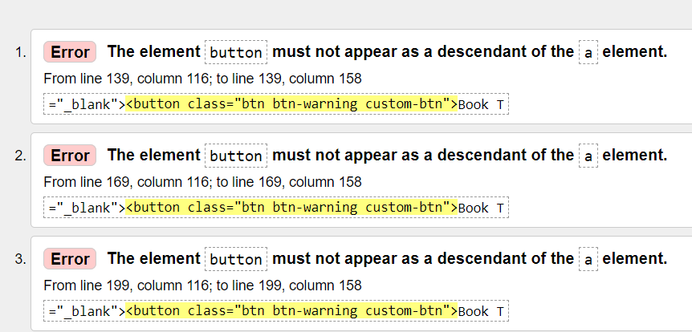
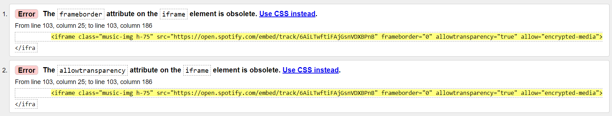
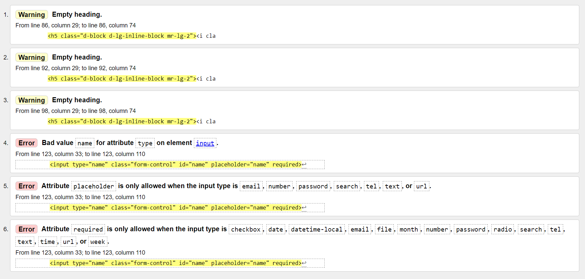
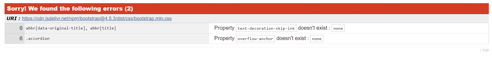
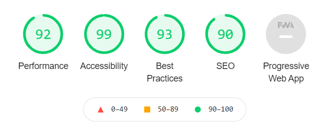
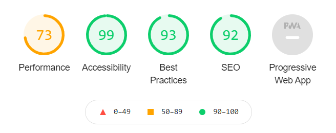

## Testing

### Browser Compatability

- I tested the appearance and responsiveness of the website across many different devices using Chrome Dev Tools.
- Generally, the appearance and responsiveness is quite good on different devices.
- Browsers tested:
    - Chrome
    - Firefox
    - Microsoft Edge
- Devices tested:
    - Windows laptop
    - iPad
    - Android Phone

### Code Validation

Testing HTML with [The W3C Markup Validation Service ](https://validator.w3.org/)
- Home page errors discovered when run through validation:

- There were no errors on the About page.

- For the Media page the following two errors were discovered for each of the six Spotify music clips:

- There were no errors on the Shop page.

- For the Contact page the following errors were discovered:

- Resolution of errors:
    - Home page errors were resolved by adding the button classes to the anchor tag.
    - Media page errors were resolved by removing those obsolete attributes.
    - Contact page errors were resolved by changing the input type from "name" to "text".

Testing CSS with the [Jigsaw CSS Validation Service ](https://jigsaw.w3.org/css-validator/)
- While there were no errors with my own custom style.css file, the following two errors were discovered in Bootstrap's style sheet:

- The above two errors are minor, and relate to CSS selectors that are not used in my website.
- Warnings were also discovered, but these relate mainly to "unknown vendor extensions", which can be safely ignored.

### Performance Testing

Testing page with Lighthouse in Chrome Dev Tools to optimise performance, accessibility, best practices and SEO

- Lighthouse desktop report:

- Lighthouse mobile report:

- Accessibility, Best Practices and SEO were roughly the same on desktop and mobile, the only difference was in performance. Performance was roughly 92 on desktop and 73 on mobile. This was largely as a result of loading the hero image.

- The hero image was orignally in .png format and was 848 KB. I decided then to convert it to .jpg format which reduced the size to 85.3 KB. Using the .jpg version led to a major improvement in performance on mobile as can be seen from the screenshot below:

### Testing User Stories
As a **fan**, I want:
1.	The ability to navigate through the site in a smooth and intuitive fashion.
    * It is very easy to navigate through the site as the navbar is fixed in view, and the current page you are on is highlighted.
2.	To see the band's latest news and activities.
    * The Home page shows the band's latest news and activities.
3.	The ability to book the band for gigs.
    * The Contact page provides contact details and a form booking the band for gigs.
4.	The ability to contact the band for general queries.
    * The Contact page provides contact details and a form booking the band for gigs.
5.	To have the option of purchasing the band's music/merchandise.
    * The Shop page allows you to purchase the band's music and merchandise.
6.	To follow the band on their social media accounts.
    * Social media links are provided in the footer of the website.

As a **potential fan**, I want:
1.	The ability to navigate through the site in a smooth and intuitive fashion.
    * It is very easy to navigate through the site as the navbar is fixed in view, and the current page you are on is highlighted.
2.	The ability to watch and listen to some of the band's music videos and clips..
    * The Media page allows the user to click to play a music video and clips from the band.
3.	The ability to find out more about those involved in the band and their history.
    * The About page details the history of the band and shows the current makeup of the band.

As a **site owner**, I want:
1.	To showcase the band's latest news and activities.
    * Home page carries out this functionality.
2.	To provide contact information for booking and other queries.
    * Contact page carries out this functionality.
3.	To sell more of the band's music/merchandise.
    * Shop page carries out this functionality.
4.	To provide details about the band's history and members.
    * About page carries out this functionality.
5.	To showcase some of the band's best known songs with videos and music clips.
    * Media page carries out this functionality.
6.	To provide links to the band's social media accounts.
    * Footer carries out this functionality.

---
## Bugs
**Bug:** Burger menu wasn't showing dropdown of navigation links when clicked.

**Fix:** The solution was to revisit the "Progressive Enhancement With JavaScript Components - Part 1" lesson from the User Centric Frontend Development module, where I saw that jQuery, Popper, and Bootstrap scripts had to be included at the bottom of the body element to make the dropdown menu work properly.

**Bug:** Problem with horizontal scrolling on the contact page.

**Fix:** Solution was to set the margin to 0 for the Bootstrap row where the problem was.

**Bug:** Problem with my CSS styles not updating in my browser preview.

**Fix:** After asking for help on Slack, I was told that this was as a result of browser caching of my old CSS stylesheet. The solution therefore was to use a hard refresh of the page, done by holding Shift + refreshing the page.